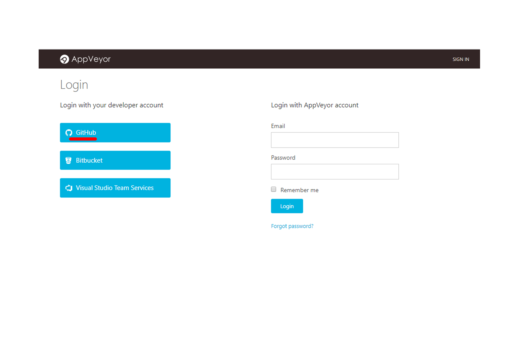
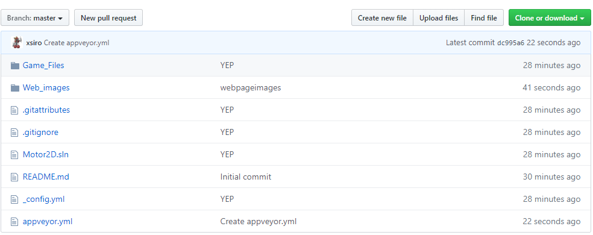
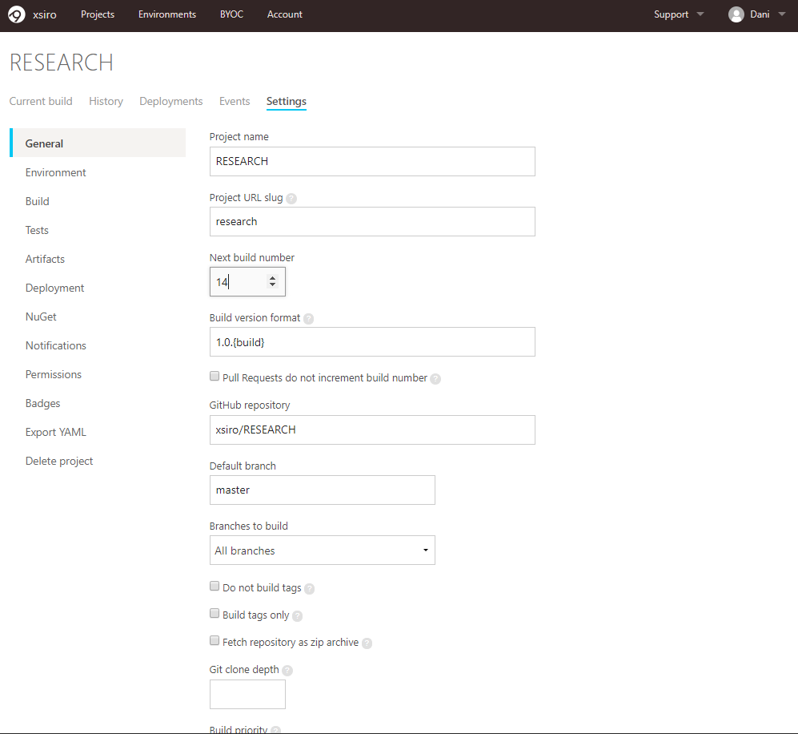

"I am Daniel Ruiz, an student from CITM of videogames degree. This is my research about automated builds from project 2".

# AUTOMATED BUILDS

## What is an automated build?
Automated builds are a practise of automatic building a software typically on every commit. Often could why we are testing, so you can understand very quickly if any commits causing any issues in the build and unit testing process.

## Continuous integration (CI)
  The continuous integration is a development practice that requires developers to integrate code into a shared repository several times a day. Each check-in is then verified by an automated build, allowing teams to detect problems early.

### Benefits
- Say goodbye to long and tense integrations
- Increase visibility enabling greater communication
- Catch issues early and nip them in the bud
- Spend less time debugging and more time adding features
- Build a solid foundation
- Stop waiting to find out if your code’s going to work
- Reduce integration problems allowing you to deliver software more rapidly

## Continuous delivery (CD)
Continuous Delivery is the ability to get changes of all types, including new features, configuration changes, bug fixes and experiments into production, or into the hands of users, safely and quickly in a sustainable way.

### Benefits
- Low risk releases: make the software deployments painless 
- Faster time to market
- Higher quality
- Lower costs
- Better products
- Happier team

## Continuous deployment (CD)
Continuous deployment is a strategy for software releases where in any code commit that passes the automated testing phase is automatically released into the production environment, making changes that are visible to the software's users.

### Benefits
- Eliminate DIY for Continuous Delivery and increase the focus on the product.
- Automate the repetitive tasks and focus on actual testing.
- Make deployments frictionless without compromising security.
- Scale from a single application to an Enterprise IT portfolio.
- Connect your existing tools and technologies (such as CI providers, DevOps tools, or scripts) into a harmonious workflow.
- Integrate teams and processes with a unified pipeline.
- Create workflows across the development, testing, and production environments
- Provide a single view across all applications and environments.
- Ship both cloud-native and traditional applications in a unified pipeline.
- Improve overall productivity.

## AppVeyor

### What is AppVeyor?
AppVeyor is a program that every time a commit is done to the code, it automatically uploads the build with all the needed artifacts to the Release page of GitHub giving you feedback of how the build has been done.

## Tutorial

### Starting
- To begin with, we will need to create an account on AppVeyor using our GitHub account.
- Then, we will need to authorize it. If the GitHub repository to apply it is from an organization, it will require the authorization of the organization's owner. So it’s recommended to be done by the owner himself.

- Once we have synchronized both applications, we can go on with AppVeyor creating a new project and selecting the GitHub repository which we want to have automated builds.
- Now we have our project in AppVeyor, by default every time we make a commit, it will try to make a built, but it probably fails due to the app configuration is not the correct. So the next step is how to configure it.

## Configuration
- First of all you need to know that there are two ways to configure an AppVeyor project. The first one it is found in the project itself, in the Settings section.

- The second one is creating in your Github repository a YAML file named appveyor.yml where is found the same configuration but in YAML format.

- AppVeyor will give preference to the YAML file before the project settings. So be careful.
- The project settings is divided in different sections, the main one is General. There, the most relevant option is that you can configure the Build version format, that will increase every time a built is done (regardless of if it fails). Another useful setting is that you can select from which branch you want to make the built every time a commit is done, in Default branch and Branches to build.

- The next important setting is found in Environment where you have to select which Visual Studio version are you using.

![]Docs/Images/Captura5.PNG)

- Another option is that one that uploads the build done to our GitHub releases page. It is found in Deployment and is need to change the deployment provider to GitHub Releases. It is recommended to add a Release description and mark the Draft Release to avoid having all the releases you made there. But before all of that is needed an authentication from GitHub to let AppVeyor modify our repository. It is done through a GitHub authentication token.

![]Docs/Images/Captura6.PNG)

![]Docs/Images/Captura7.PNG)

## How to get GitHub authentication token

- Token is like a password, so manage them like that. The difference is that it is used for scripts or commands, and in addition you can revoke them and generate lots of them. So, to generate one of them you need to go Here or manually going to your GitHub, and go to Settings (the general settings, not the repository ones). There is a section Developer Settings with a subsection Personal Access Tokens.

![]Docs/Images/Captura8.PNG)

- There you need to Generate a new token and just select the scope public_repo and then Generate it.

![]Docs/Images/Captura9.PNG)

- Once done the token has to be copied to encrypt it, the result is an encrypted token that has to be copied to the GitHub authentication token in the Deployment setting that we were talking before.

![]Docs/Images/Captura.PNG)

